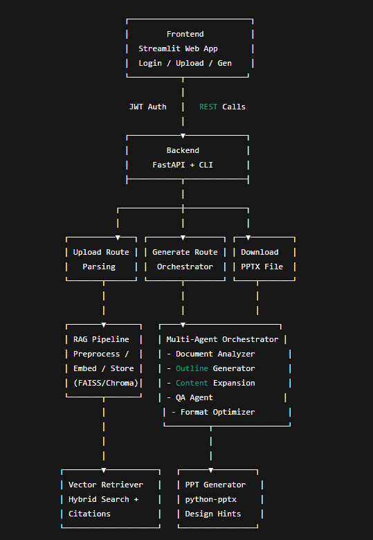

Contextual AI Presentation Orchestrator
=======================================

Overview
--------

The Contextual AI Presentation Orchestrator is a multi-agent system designed to automatically transform raw documents and topics into professional, structured PowerPoint presentations. It leverages Retrieval-Augmented Generation (RAG), specialized content agents, and role-based access control (RBAC) to ensure accurate, fact-checked, and presentation-ready outputs.

This project demonstrates a production-grade AI system with end-to-end functionality, from ingestion to orchestration, validation, and final PPTX generation.

* * * * *

Key Features
------------

-   **Multi-Agent Orchestration**: Five specialized agents (Document Analysis, Outline Generator, Content Expansion, QA, and Format Optimizer).

-   **RAG Pipeline**: FAISS/ChromaDB-based vector store with hybrid retrieval, citation tracking, and contradiction detection.

-   **Context Management**: Memory modules and session persistence for multi-turn workflows.

-   **Security**: JWT authentication and RBAC for four roles (Executive, Senior Manager, Analyst, Junior Staff).

-   **Deployment**: Fully containerized using Docker and orchestrated with Docker Compose.

-   **API + CLI + Frontend**: REST endpoints via FastAPI, CLI via Typer, and user interface via Streamlit.

-   **Production Readiness**: Logging, observability, and pytest-based validation.

* * * * *

System Architecture Diagram
---------------------------

* * * * *

Development Workflow
--------------------

**Phase 1 -- Architecture & Planning**

-   Defined multi-agent orchestration, RAG pipeline, memory, and security model.

**Phase 2 -- Core Implementation**

-   Built preprocessing and hybrid retrieval.

-   Developed 5 custom agents and integrated via LangChain.

-   Exposed via FastAPI and CLI.

**Phase 3 -- Production Readiness**

-   Implemented JWT-based authentication and RBAC.

-   Added observability and pytest coverage.

-   Dockerized backend and frontend for containerized deployment.

**Phase 4 -- Final Polish**

-   Executed end-to-end testing.

-   Prepared system diagram, documentation, and demo.

* * * * *

Future Enhancements
-------------------

-   **Professional PPT Design**: Integrate advanced design hints into python-pptx for visually consistent, branded presentations.

-   **Real-Time Multi-User Collaboration**: Enable live co-editing of outlines and expansions through WebSocket/Socket.io integration.

-   **Database-Backed Authentication**: Migrate from hardcoded role mapping to a persistent database-driven authentication and role management system (e.g., PostgreSQL).

-   **Scalability**: Deploy on Kubernetes with horizontal scaling of orchestrator pods.

* * * * *

Tech Stack
----------

-   **Core**: Python 3.11

-   **LLM Orchestration**: LangChain + ChatGroq

-   **Vector Search**: FAISS / ChromaDB

-   **Embeddings**: Sentence Transformers (all-MiniLM-L6-v2)

-   **API Framework**: FastAPI

-   **Frontend**: Streamlit

-   **Auth**: JWT with RBAC

-   **PPT Generation**: python-pptx

-   **Deployment**: Docker + Docker Compose

* * * * *

Developer Setup Guide
=====================

This guide explains how to set up, run, and test the **Contextual AI Presentation Orchestrator** locally and via Docker.

* * * * *

1\. Prerequisites
-----------------

-   Python 3.11+

-   Docker & Docker Compose

-   Git

* * * * *

2\. Clone the Repository
------------------------

`git clone https://github.com/yourusername/contextual_ai_presentation_orchestrator.git
cd contextual_ai_presentation_orchestrator`

* * * * *

3\. Environment Setup (Local)
-----------------------------

### Create Virtual Environment

`python3 -m venv venv
source venv/bin/activate   # On Windows: venv\Scripts\activate`

### Install Dependencies

`pip install --upgrade pip
pip install -r requirements.txt`

* * * * *

4\. Running Backend (Local)
---------------------------

Navigate to the **api** folder:

`cd api
uvicorn main:app --reload --port 8000`

Backend will start at:

`http://127.0.0.1:8000`

Docs available at:

`http://127.0.0.1:8000/docs`

* * * * *

5\. Running Frontend (Local)
----------------------------

Go back to root and run Streamlit app:

`cd ..
streamlit run frontend/app.py --server.port=8501`

Frontend available at:

`http://127.0.0.1:8501`

* * * * *

6\. Docker Setup (Recommended)
------------------------------

### Build and Run Containers

From project root:

`docker-compose build
docker-compose up`

-   Frontend runs on **<http://localhost:8501>**

-   Backend runs on **<http://localhost:8000>**

Logs for each service:

`docker-compose logs backend
docker-compose logs frontend`

### Stop Containers

`docker-compose down`

* * * * *

7\. Project Structure
---------------------

contextual_ai_presentation_orchestrator/

│── agents/                # Multi-agent orchestration logic

│   ├── orchestration.py

│   ├── document_analysis_agent.py

│   ├── outline_generator_agent.py

│   ├── content_expansion_agent.py

│   ├── qa_agent.py

│   └── format_optimizer_agent.py

│

│── rag_pipeline/          # RAG (Retrieval-Augmented Generation) pipeline

│   ├── preprocess.py

│   ├── embeddings.py

│   ├── vector_store.py

│   └── retriever.py

│

│── api/                   # Backend (FastAPI)

│   ├── routes/

│   │   ├── memory.py

│   │   ├── auth.py

│   │   ├── upload.py

│   │   ├── generate.py

│   │   └── download.py

│   └── main.py

│

│── cli/                   # CLI interface

│   └── cli_interface.py

│

│── utils/                 # Utilities (security, PPTX, logging, config, etc.)

│   ├── security.py

│   ├── ppt_generator.py

│   ├── middleware.py

│   ├── memory.py

│   ├── config.py

│   └── logger.py

│

│── tests/                 # Pytest unit tests

│── Dockerfile             # Backend Dockerfile

│── Dockerfile.frontend    # Frontend Dockerfile

│── docker-compose.yml     # Orchestration of backend + frontend

│── requirements.txt       # Dependencies

│── README.md              # Documentation

* * * * *